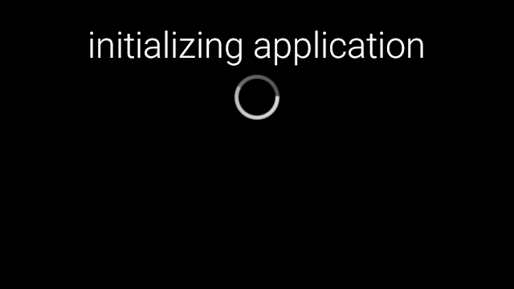
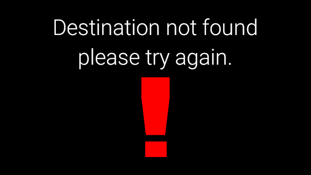
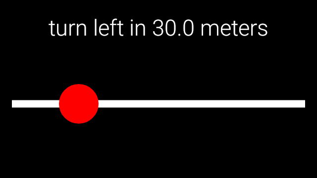
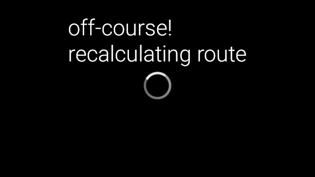
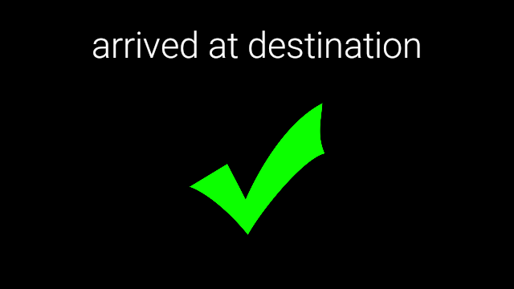

Glass Application
===

This application was used as the demo for my Senior Desing project. It was set up to run in one of the floors in one of the building at my University. It was set up as a basic demo of what the Bluewalker libraries can do. It can give turn-by-turn directions to the specified room. 

Building and installing
---

Using the gradle wrapper, use the installDebug task with your Google Glass plugin
```
./gradlew :BeaconLibExample:installDebug
```

Demo
---

Unfortunately this wont really work as it needs the grid of Beacons to be set up and it also needs access to the DynamoDB database containing all the floor data. That being said, a demo of the application can actually be created by switching a couple of the method calls to their debug alternatived.

Screenshots
---






